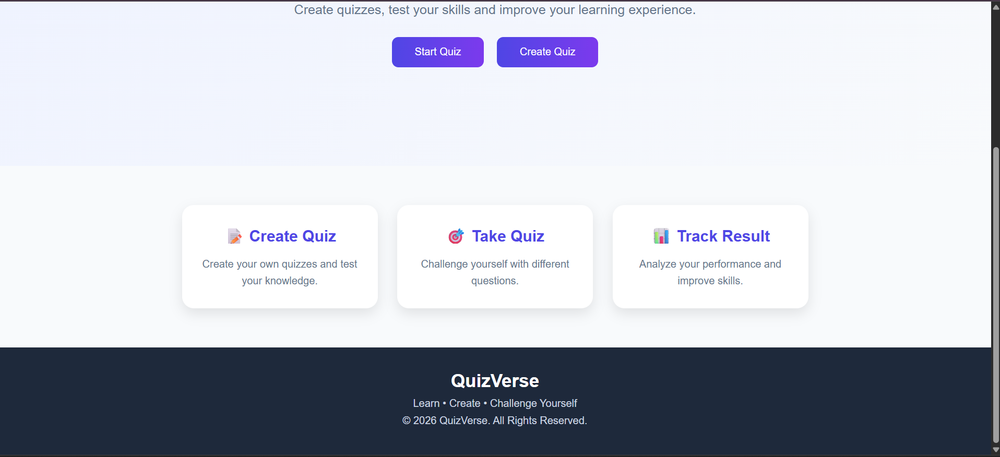
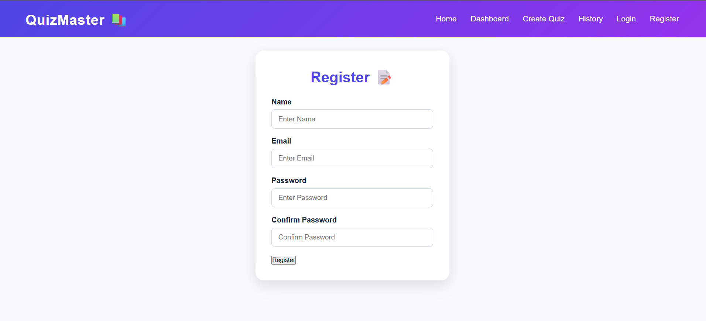
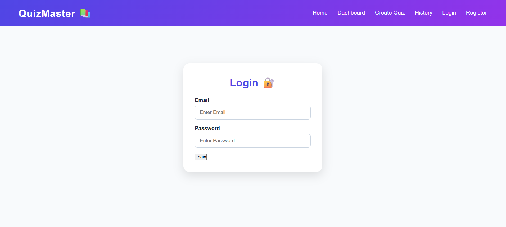
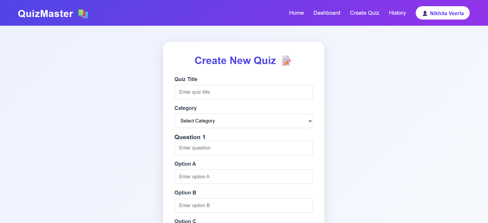
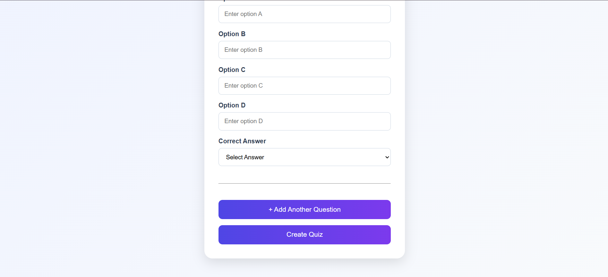
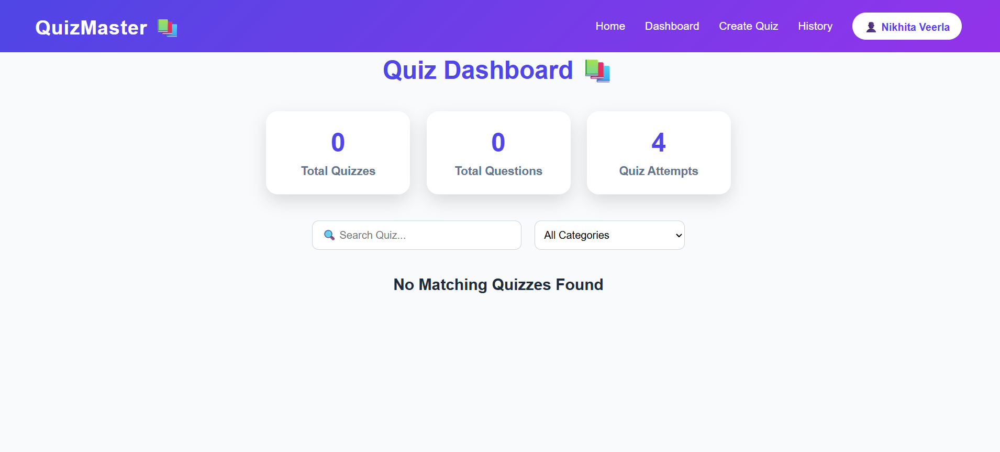
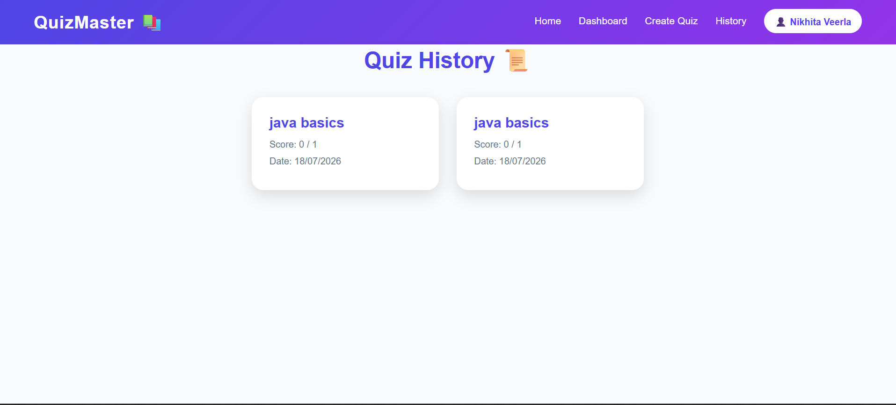
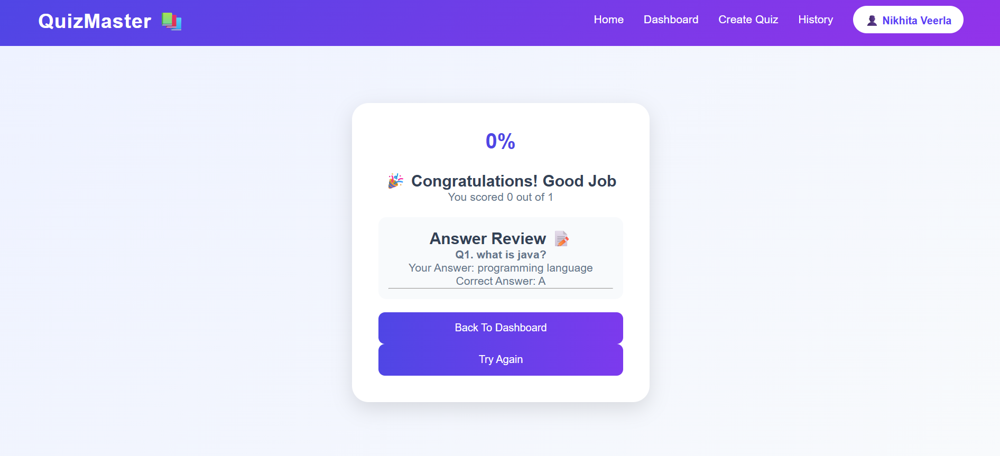

# Online Quiz Maker 📚

A React-based Online Quiz Maker application that allows users to create quizzes, take quizzes, and track their performance.
## 🌐 Live Demo

[Click Here To View Project](https://online-quiz-maker-dusky.vercel.app/)

## 🚀 Features

- User Registration and Login
- Protected Routes
- Create Custom Quizzes
- Add Multiple Choice Questions
- Edit and Delete Quizzes
- Browse Available Quizzes
- Search and Filter Quizzes
- Take Quiz with Timer
- Automatic Score Calculation
- Result Analysis
- Quiz History Tracking
- Responsive Design for Mobile Devices

## 🛠️ Technologies Used

### Frontend
- React JS
- JavaScript
- HTML5
- CSS3
- React Router

### Storage
- Browser Local Storage

## 📂 Project Structure
## 📸 Screenshots

### Home Page

### Home Page (Alternative View)

### Register Page

### Login Page

### Create Quiz Page

### Create Quiz (Additional View)

### Dashboard

### Quiz History

### Result Page

